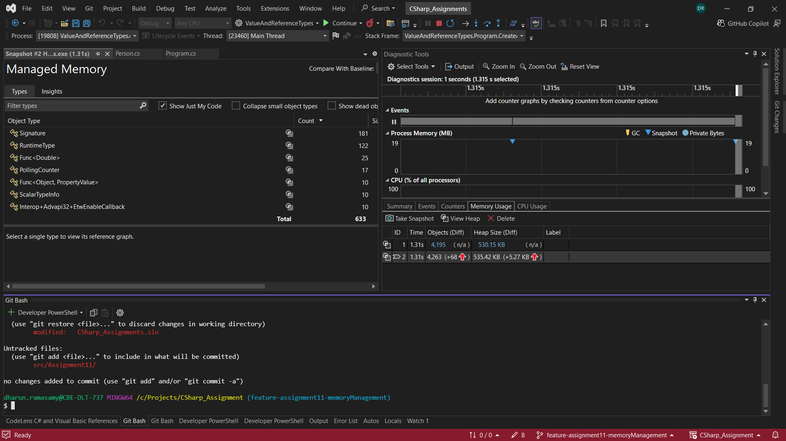

# Assignment 11

## Value Types and Reference Types in CSharp

### Value Type

- All the datatypes that stores the value of the variable directly in the memory rather than storing the reference in the memory are called value type.
- When we assign a value type to another value type variable(named copy) the copy of the value is created and stored in the variable(copy).
- So changing the value of the variable(copy) will not affect the value in the original variable.
- Example of value type:
  - int,decimal,double
  - struct
  - enum

### Reference Type

- All the datatypes that stores the reference of the object in memory instead of stored the value are called reference typed variable.
- When we assign the value of the reference type to another reference type then the reference to the object is copied.
- Now both the variables points to the same object.
- So, changing the value from the copied variable change the value of the original variable also.
- Example of reference type:
  - class, interface, object
  - string, array

## Working with the Stack and the Heap

When the memory for a reference type is created the memory of heap got increased.

Value type variable are stored in the stack.
