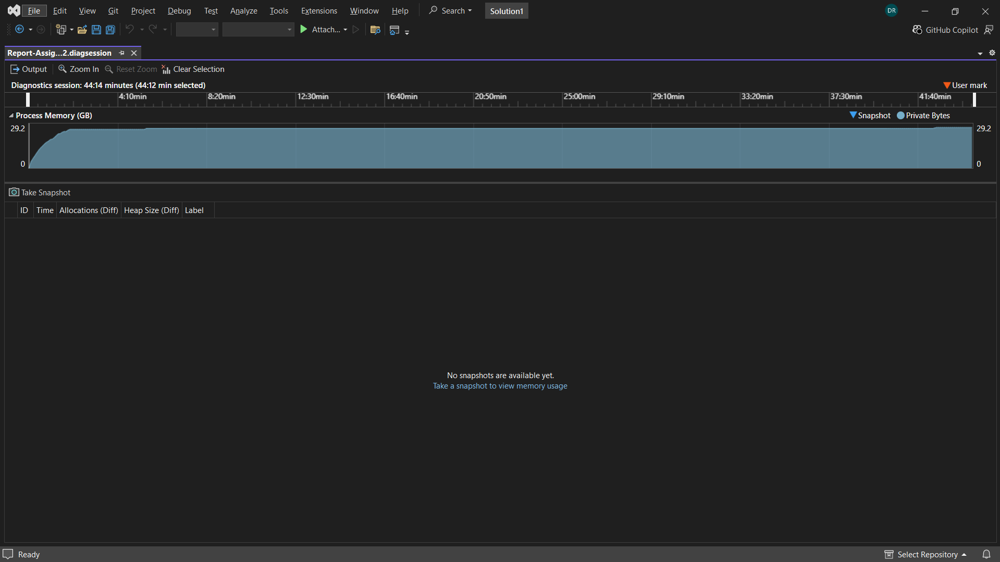
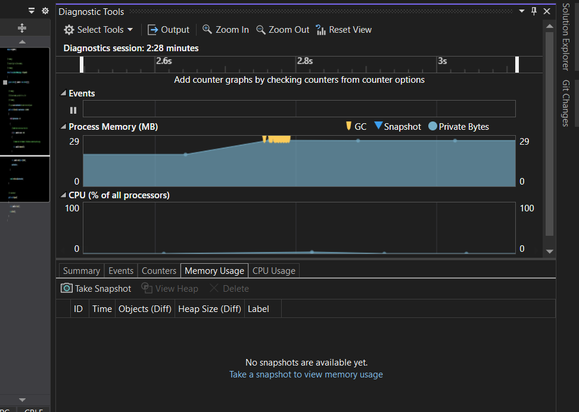
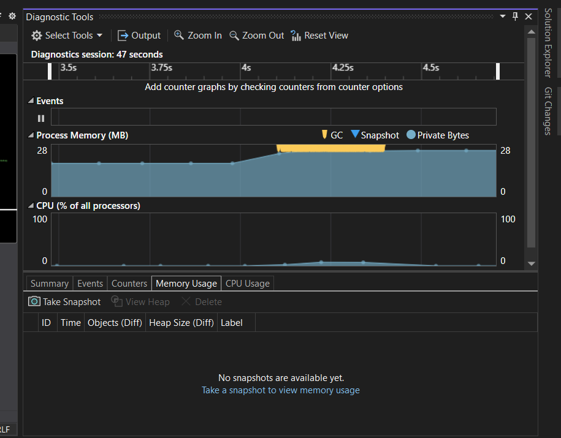

# Assignment 12 - Memory Optimization

## Task 1: Memory Leak / Optimization Identification

This section focuses on identifying and analyzing a subtle memory retention behavior in C# when managing dynamic collections, specifically looking at how `List<T>` elements are cleared versus how its internal buffers behave on the managed heap.

### Understanding about Memory Eater Code

- MemoryEater.cs creates a List of integer array.
- When the Allocate() method of MemoryEater.cs is called it increases the memory size for every 10 millisecond.
- As the all the objects have reference, the Garbage Collector doesn't collect any data.
- So the memory usage significantly rises until OutOfMemoryException gets thrown and application gets crashed.

#### Memory Usage Before Optimization

### Understanding about Memory Optimization

- In MemoryOptimization.cs creates a List of integer array.
- The "MemoryOptimization" instance is created within "using" statement.
- The IDisposable interface is implemented in MemoryOptimization class and implemented the Dispose method
- The Allocate method rises the memory usage to a certain level and when the threshold is reached it returns.
- Since the MemoryOptimization is enclosed within "using" statement, the Dispose method is automatically called.
- As the List is a managed resource, the memory resource cannot be Disposed.
- Instead the list is dereferenced and forced Garbage Collector to collect the unreferenced objects.

#### Memory Usage After Optimization

