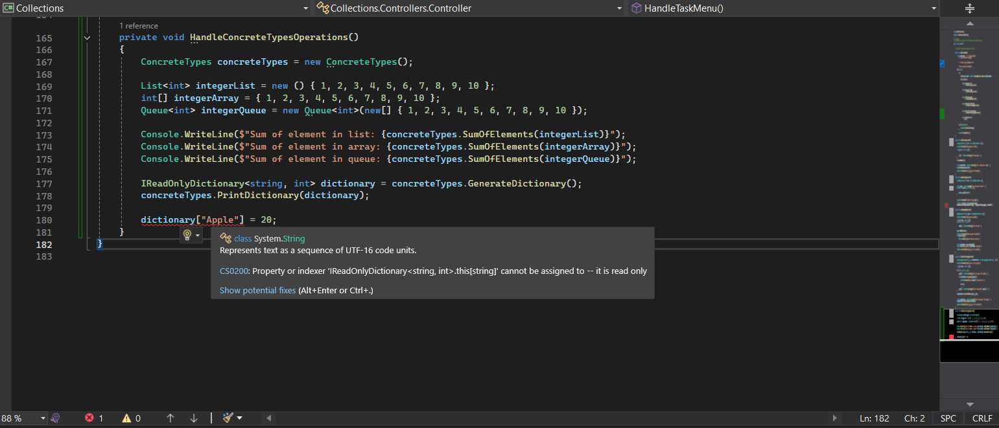

# Understanding and Practicing Collections and Generics in C #

## Task 1-4

This assignment helped me understand and practice the different collection types available in C# and how they can be used depending on the requirements of an application. I worked with `List`, `Stack`, `Queue`, and `Dictionary`, and later converted the implementations to use generics.

Through this assignment, I learned the differences between the commonly used collection types in C#:

- **`List<T>`** is useful when elements need to be stored in an ordered collection and accessed using an index.
- **`Stack<T>`** follows the **LIFO (Last In, First Out)** principle. The last element added is the first element removed.
- **`Queue<T>`** follows the **FIFO (First In, First Out)** principle. The first element added is the first element removed.
- **`Dictionary<TKey, TValue>`** stores data as key-value pairs and allows values to be retrieved efficiently using their keys.

I also learned how to use methods such as `Add`, `Remove`, `Contains`, `Push`, `Pop`, `Enqueue`, `Dequeue`.

## Generics

Instead of creating collections that work only with a particular type, generic collections allow the type to be specified while creating the collection.

For example:

```csharp
ListOperations<string> books = new ListOperations<string>();
StackOperations<char> characters = new StackOperations<char>();
QueueOperations<string> people = new QueueOperations<string>();
DictionaryOperation<string, int> students = new DictionaryOperation<string, int>();
```

## Understanding `IEnumerable<T>`, Concrete Types, and `ReadOnlyDictionary`

This task focuses on understanding `IEnumerable<T>`, concrete collection types, and `ReadOnlyDictionary<TKey, TValue>` in C#.

### Understanding `IEnumerable<T>`

A method named `SumOfElements` is implemented to accept an `IEnumerable<int>` and calculate the sum of all elements.

Using `IEnumerable<int>` allows the method to work with different collection types such as:

- `List<int>`
- `Array`
- `Queue<int>`
- Other collections that implement `IEnumerable<int>`

### Understanding `ReadOnlyDictionary<TKey, TValue>`

A `Dictionary<string, int>` is created to store student names and their grades. The dictionary is then used to create a `ReadOnlyDictionary<string, int>`, which is passed to methods that only need to read and display the data.

The task also implements a `PrintDictionary` function to iterate through the dictionary and display each student's name and grade.

This task helped me understand how `ReadOnlyDictionary<TKey, TValue>` can be used to expose dictionary data without allowing modifications through the read-only reference. It also reinforced the importance of controlling data access and separating reading operations from modification operations.


